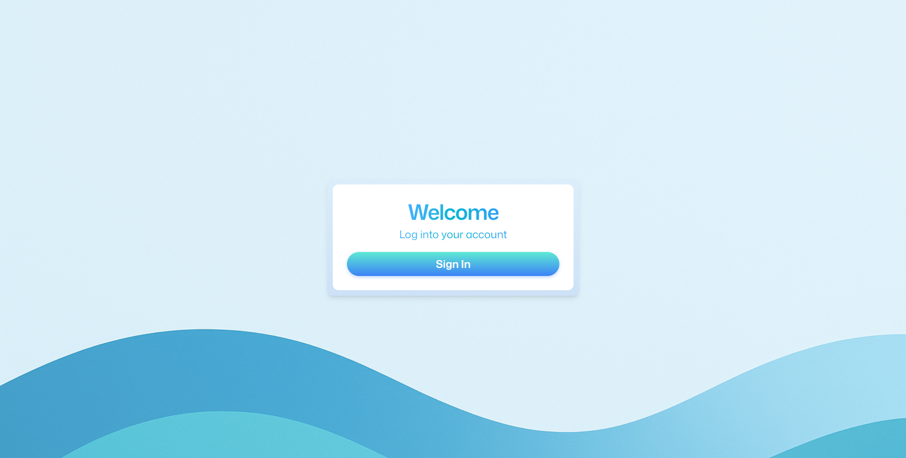
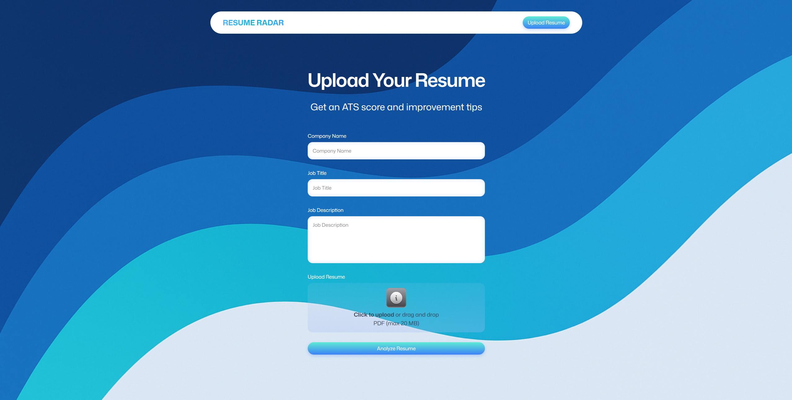
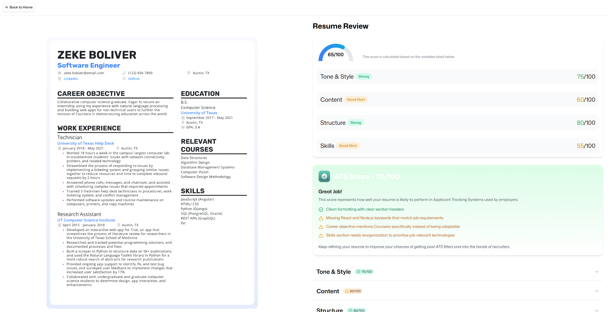
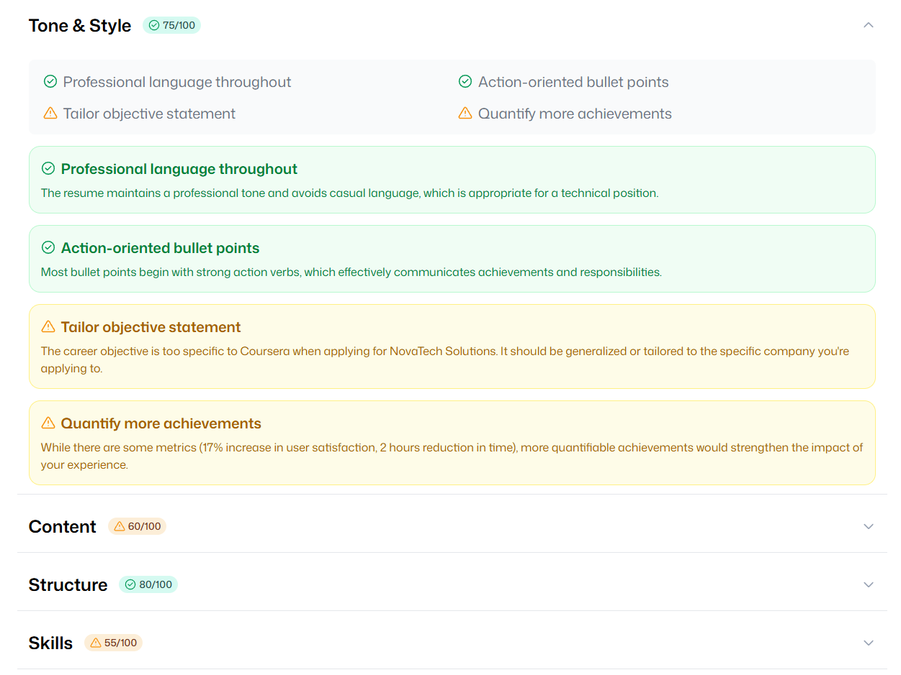
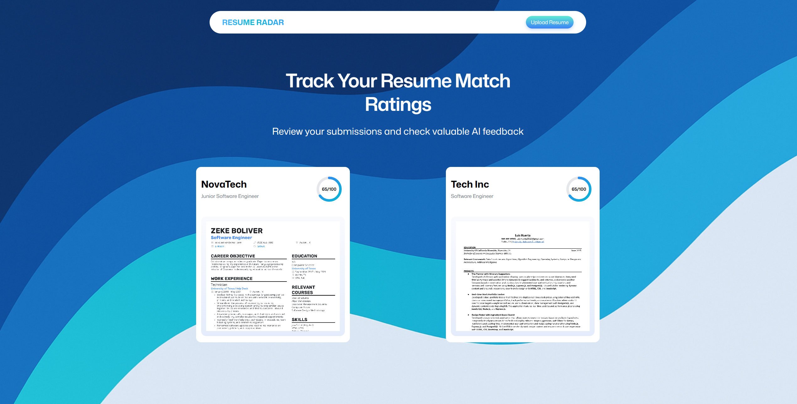

# Resume Radar — AI-Powered Resume Analyzer

> Upload your resume, paste a job description, and receive instant AI feedback — ATS score, strengths, weaknesses, and actionable improvement tips across five dimensions.

[![React][react-shield]][react-url]
[![TypeScript][typescript-shield]][typescript-url]
[![React Router][reactrouter-shield]][reactrouter-url]
[![TailwindCSS][tailwind-shield]][tailwind-url]
[![Zustand][zustand-shield]][zustand-url]
[![Puter][puter-shield]][puter-url]

---

## What Is Resume Radar?

Resume Radar is a full-stack web application that gives job seekers an edge by analyzing their resumes against real job descriptions using **Claude 3.7 Sonnet** (via Puter AI). It evaluates ATS compatibility, writing quality, content relevance, document structure, and skills alignment — then presents the results through interactive visualizations and expandable feedback cards.

**No backend server. No environment variables. No API keys to manage.** All infrastructure — authentication, file storage, AI inference, and data persistence — is handled through the Puter platform.

---

## Features

### AI-Powered Resume Analysis
- **ATS Score** — Measures how well the resume is likely to pass Applicant Tracking Systems
- **5-Dimension Feedback** — Independent scores for Tone & Style, Content, Structure, and Skills
- **Job-Specific Analysis** — AI cross-references the resume against the provided job title and description
- **Honest Scoring** — The model is prompted to give genuinely low scores when improvement is needed, not inflated results

### File Handling
- **PDF Upload** — Drag-and-drop or click-to-select interface, up to 20 MB
- **Automatic Thumbnails** — Resumes are rendered to high-resolution PNG previews client-side using `pdfjs-dist` at 4× scale
- **Cloud Storage** — PDF and thumbnail files are stored in Puter's cloud file system per user

### Visualizations
- **Score Gauge** — Half-arc SVG gauge for the overall score on the feedback page
- **Score Circle** — Circular SVG progress ring on resume history cards
- **Color-Coded Badges** — Three-tier system (Strong / Good Start / Needs Work) applied consistently across all score displays
- **Expandable Accordions** — Each feedback category expands to show a tip overview grid and detailed explanation cards

### User Experience
- **Persistent Resume History** — All past submissions and their feedback are saved to Puter KV and displayed on the dashboard
- **Secure Authentication** — Sign in with a Puter account; no credentials stored in the application
- **Responsive Layout** — Side-by-side resume preview and feedback panel on desktop; stacked on mobile

---

## Tech Stack

| Layer | Technology |
|---|---|
| Framework | React Router v7 (SSR) |
| Language | TypeScript |
| Styling | Tailwind CSS v4 |
| State Management | Zustand |
| Backend / Auth / AI | Puter.js (Auth, FS, KV, AI) |
| AI Model | Claude 3.7 Sonnet (via Puter AI) |
| PDF Processing | pdfjs-dist |
| File Input | react-dropzone |
| Build Tool | Vite |

---

## How It Works

### 1. Sign In

Users authenticate through Puter's OAuth-style sign-in modal. Session state is managed client-side by the Puter SDK and reflected in the Zustand store.



---

### 2. Upload & Describe the Job

Users upload their resume (PDF) and optionally provide a company name, job title, and full job description. The job context is passed directly to the AI to produce role-specific feedback.



---

### 3. Automated Analysis Pipeline

After submission, a 6-step pipeline runs automatically:

1. PDF uploaded to Puter cloud file system
2. First page rendered to a 4× scale PNG thumbnail client-side
3. Thumbnail uploaded to Puter cloud file system
4. Resume record stub saved to Puter KV (with a UUID key)
5. Resume file + job details sent to Claude 3.7 Sonnet for analysis
6. Structured JSON feedback saved back to the KV record

Live status updates are shown at each step.

---

### 4. Feedback Dashboard

The feedback page presents the AI's analysis across three sections:

- **Summary Panel** — Overall score gauge + category scores with color-coded badges
- **ATS Card** — ATS compatibility score with pass/fail tips
- **Detailed Breakdown** — Accordion sections for Tone & Style, Content, Structure, and Skills, each showing a tip overview grid and full explanation cards




---

### 5. Resume History

The home dashboard lists all previously submitted resumes with their thumbnail previews and ATS scores. Click any card to re-open the full feedback view.



---

## Project Structure

```
app/
  routes/           # Page components (home, auth, upload, resume, wipe)
  components/       # Reusable UI components
  lib/
    puter.ts        # Zustand store — all Puter API wrappers
    pdfToImage.ts   # Client-side PDF → PNG conversion
    utils.ts        # cn(), formatSize(), generateUUID()
  constants/
    index.ts        # AI prompt builder and response schema
```

---

<!-- Badge References -->
[puter-shield]: https://img.shields.io/badge/Puter-API-000000?style=for-the-badge&logo=puter&logoColor=white
[puter-url]: https://developer.puter.com/

[react-shield]: https://img.shields.io/badge/React-20232A?style=for-the-badge&logo=react&logoColor=61DAFB
[react-url]: https://react.dev/

[typescript-shield]: https://img.shields.io/badge/TypeScript-007ACC?style=for-the-badge&logo=typescript&logoColor=white
[typescript-url]: https://www.typescriptlang.org/

[reactrouter-shield]: https://img.shields.io/badge/React_Router-CA4245?style=for-the-badge&logo=react-router&logoColor=white
[reactrouter-url]: https://reactrouter.com/

[node-shield]: https://img.shields.io/badge/Node.js-43853D?style=for-the-badge&logo=node.js&logoColor=white
[node-url]: https://nodejs.org/

[tailwind-shield]: https://img.shields.io/badge/Tailwind_CSS-38B2AC?style=for-the-badge&logo=tailwind-css&logoColor=white
[tailwind-url]: https://tailwindcss.com/

[zustand-shield]: https://img.shields.io/badge/Zustand-323330?style=for-the-badge&logo=react&logoColor=white
[zustand-url]: https://github.com/pmndrs/zustand

[javascript-shield]: https://img.shields.io/badge/JavaScript-F7DF1E?style=for-the-badge&logo=javascript&logoColor=black
[javascript-url]: https://developer.mozilla.org/en-US/docs/Web/JavaScript
